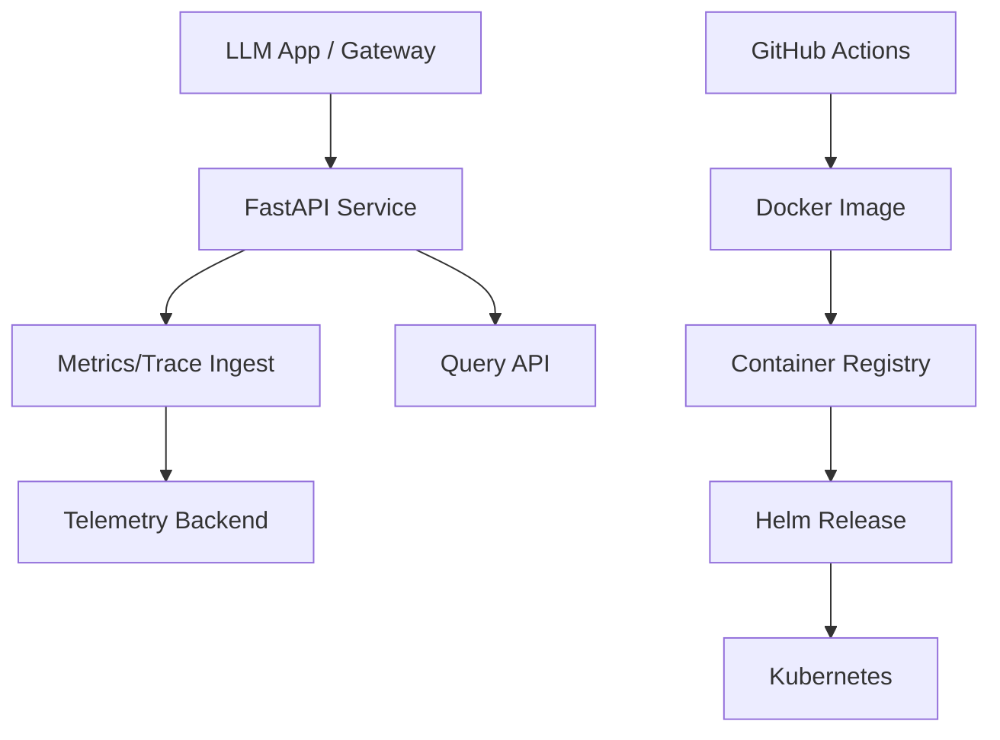

# Architecture

```mermaid
flowchart TB
    Client[LLM App / Gateway] --> Api[FastAPI Service]
    Api --> Ingest[Metrics/Trace Ingest]
    Ingest --> Store[Telemetry Backend]
    Api --> Dashboard[Query API]
    CI[GitHub Actions] --> Image[Docker Image]
    Image --> Registry[Container Registry]
    Registry --> Helm[Helm Release]
    Helm --> K8s[Kubernetes]
```
